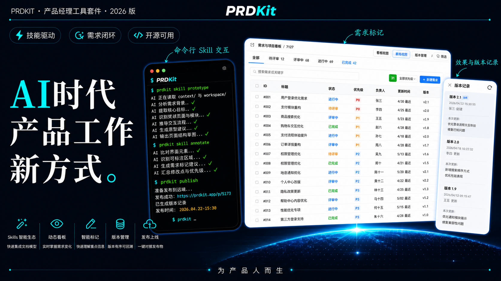

<div align="center">

# PRDKit

**AI 时代产品工作新方式 · 为产品人而生**



<p align="center">
  <a href="https://www.npmjs.com/package/@huangqz/prdkit-cli"></a>
  <a href="#license"></a>
  <a href="https://nodejs.org/"></a>
  <a href="https://www.typescriptlang.org/"></a>
  <a href="https://claude.ai"></a>
</p>

一个专为产品经理设计的 CLI 工具套件,通过 **技能驱动**、**需求闭环**、**开源可用** 三大核心理念,帮助产品团队在 AI 时代实现高效的产品文档管理和原型协作。

[快速开始](#快速开始) · [功能特性](#功能特性) · [命令文档](#命令文档)

</div>

---

## ✨ 功能特性

### 🎯 核心能力

- **⚡ 技能驱动** - 通过命令行 Skill 交互,快速完成文档创建和原型管理
- **🔄 需求闭环** - 从 PRD 编写到原型标注,形成完整的需求管理闭环
- **🌐 开源可用** - 完全开源,支持自定义模板和工作流

### 🚀 五大功能模块

| 功能 | 描述 |
|------|------|
| **Skills 智能生态** | 快速单元文档模型,通过预设模板加速文档创建 |
| **动态看板** | 实时掌握需求变化,可视化管理项目进度 |
| **智能标记** | 快速理解重点信息,支持原型标注和版本对比 |
| **版本管理** | 版本有序回溯,Checkpoint 系统保障原型演进 |
| **发布上线** | 一键到发布物,支持原型导出和归档 |

## 📦 安装

### 全局安装(推荐)

```bash
npm install -g @huangqz/prdkit-cli
```

### 本地安装

```bash
npm install @huangqz/prdkit-cli
```

### 系统要求

- Node.js >= 20.0.0

### 验证安装

```bash
prdkit --version
```

## 🚀 快速开始

### 1. 初始化项目

```bash
# 在当前目录初始化产品项目
prdkit init

# 在指定目录初始化
prdkit init my-product

# 非交互式初始化
prdkit init --name "我的产品" --author "张三" --non-interactive
```

初始化后会创建标准化的项目结构:

```
my-product/
├── context/          # 稳定的项目背景信息
│   ├── 01_产品架构/
│   ├── 02_功能模块/
│   ├── 03_上线功能/
│   ├── 04_运营材料/
│   └── 05_会议纪要/
├── draft/           # 临时性内容和探索过程
│   ├── 临时目录/
│   └── 方案探索/
├── workspace/       # 当前正在推进的工作
│   ├── bugs/
│   ├── discussions/
│   ├── prds/
│   └── prototypes/
└── .prdkit/
    └── config.json  # 项目配置文件
```

### 2. 创建 PRD 文档

```bash
# 创建 PRD 文档
prdkit create "用户认证功能"

# 指定文档类型
prdkit create "用户认证功能" --type prd

# 指定输出目录
prdkit create "用户认证功能" --output workspace/prds
```

### 3. 创建原型

```bash
# 创建 Web 原型
prdkit prototype create "登录页面"

# 使用指定模板
prdkit prototype create "登录页面" --template web

# 创建移动端原型
prdkit prototype create "个人中心" --template mobile
```

### 4. 启动预览服务器

```bash
# 启动原型预览服务器
prdkit serve

# 指定端口
prdkit serve -p 8080

# 开发模式(支持热更新)
prdkit serve --dev
```

## 📖 命令文档

### `prdkit init [directory]`

初始化产品项目脚手架。

**选项:**
- `--name <name>` - 项目名称
- `--author <author>` - 作者名称
- `--non-interactive` - 非交互模式
- `--scaffold-repo <url>` - 自定义 scaffold 仓库
- `--template-repo <url>` - 自定义模板仓库

**示例:**
```bash
prdkit init my-product --name "我的产品" --author "张三"
```

---

### `prdkit create <title>`

从模板创建文档。

**选项:**
- `--type <type>` - 文档类型 (prd, prototype)
- `--output <dir>` - 输出目录
- `--template <name>` - 使用指定模板

**示例:**
```bash
prdkit create "用户认证功能" --type prd
prdkit create "登录页面" --type prototype
```

---

### `prdkit prototype`

原型管理命令组。

#### `prdkit prototype create <title>`

创建新原型。

**选项:**
- `--template <name>` - 原型模板 (web, mobile, admin)
- `--output <dir>` - 输出目录

**示例:**
```bash
prdkit prototype create "登录页面" --template web
```

#### `prdkit prototype list`

列出所有原型。

```bash
prdkit prototype list
```

---

### `prdkit mark`

原型标注管理。

#### `prdkit mark create <prototype> <title>`

为原型创建标注。

**示例:**
```bash
prdkit mark create "登录页面" "按钮样式需要调整"
```

#### `prdkit mark list <prototype>`

列出原型的所有标注。

```bash
prdkit mark list "登录页面"
```

---

### `prdkit checkpoint`

版本管理命令组。

#### `prdkit checkpoint create <prototype> <message>`

为原型创建版本快照。

**示例:**
```bash
prdkit checkpoint create "登录页面" "完成初版设计"
```

#### `prdkit checkpoint list <prototype>`

列出原型的所有版本。

```bash
prdkit checkpoint list "登录页面"
```

#### `prdkit checkpoint restore <prototype> <checkpoint-id>`

恢复到指定版本。

```bash
prdkit checkpoint restore "登录页面" checkpoint-001
```

---

### `prdkit serve`

启动本地预览服务器。

**选项:**
- `-p, --port <port>` - 服务器端口 (默认: 自动查找 7788-7888 范围内的可用端口)
- `--no-open` - 不自动打开浏览器
- `--dev` - 开发模式(支持热更新)

**示例:**
```bash
# 使用默认端口
prdkit serve

# 指定端口
prdkit serve -p 8080

# 开发模式
prdkit serve --dev
```

---

### `prdkit doctor`

诊断并修复项目结构问题。

**选项:**
- `--fix` - 自动修复发现的问题

**示例:**
```bash
prdkit doctor --fix
```

---

### `prdkit info`

显示项目统计信息和云端登录状态。

```bash
prdkit info
```

---

### `prdkit auth login`

打开浏览器登录云端服务，登录地址默认来自环境变量 `PRDKIT_CLOUD_HOST`。

```bash
prdkit auth login
```

---

### `prdkit auth logout`

清除当前云端登录状态。

```bash
prdkit auth logout
```

---

### `prdkit prototype publish`

发布原型到本地目录或云端项目。

**选项:**
- `--output <dir>` - 输出目录
- `--cloud` - 发布到云端
- `--project <idOrSlug>` - 指定云端项目
- `--message <text>` - 云端发布说明

**示例:**
```bash
prdkit prototype publish
prdkit prototype publish --output ./dist/publish/demo
prdkit prototype publish --cloud --project demo-workspace
```

## ⚙️ 配置

项目配置文件位于 `.prdkit/config.json`:

```json
{
  "version": 1,
  "projectName": "我的产品",
  "author": "张三",
  "scaffoldRepo": "git@github.com:qizhi2design-svg/scaffold.git",
  "templateRepo": "git@github.com:qizhi2design-svg/prdkit-tempaltes.git",
  "defaultCreateDirs": {
    "prd": "workspace/prds",
    "prototype": "workspace/prototypes"
  }
}
```

### 配置项说明

| 配置项 | 类型 | 说明 |
|--------|------|------|
| `version` | number | 配置文件版本 |
| `projectName` | string | 项目名称 |
| `author` | string | 作者名称 |
| `scaffoldRepo` | string | Scaffold 仓库地址 |
| `templateRepo` | string | 模板仓库地址 |
| `defaultCreateDirs` | object | 默认创建目录配置 |

## 🎨 模板系统

PRDKit 支持自定义模板,模板文件支持变量替换:

### 可用变量

- `{{title}}` - 文档标题
- `{{projectName}}` - 项目名称
- `{{author}}` - 作者
- `{{date}}` - 文档日期

### 模板结构

模板仓库的 `templates.json` 定义可用模板:

```json
{
  "templates": [
    {
      "id": "prd",
      "name": "PRD 文档",
      "description": "产品需求文档模板",
      "file": "prd.md",
      "output_suggestion": "workspace/prds"
    }
  ]
}
```

## 🤝 贡献指南

我们欢迎所有形式的贡献!

### 贡献方式

1. Fork 本仓库
2. 创建特性分支 (`git checkout -b feature/AmazingFeature`)
3. 提交更改 (`git commit -m 'Add some AmazingFeature'`)
4. 推送到分支 (`git push origin feature/AmazingFeature`)
5. 开启 Pull Request

### 开发规范

- 遵循 TypeScript 最佳实践
- 编写单元测试
- 更新相关文档
- 保持代码风格一致

### 报告问题

如果发现 bug 或有功能建议,请[创建 Issue](https://github.com/your-org/prdkit/issues)。

## 📄 许可证

本项目采用 MIT 许可证 - 详见 [LICENSE](LICENSE) 文件。

## 🙏 致谢

- 感谢所有贡献者的付出
- 灵感来源于现代产品管理实践
- 使用了优秀的开源项目: Commander.js, Inquirer, Vite, React
- 特别感谢 [@pmYangKun](https://github.com/pmYangKun) 的 [check-prd-skill](https://github.com/pmYangKun/check-prd-skill) 和 [create-prd-skill](https://github.com/pmYangKun/create-prd-skill) 项目提供的灵感和参考

---

<div align="center">

**PRDKit** - AI 时代产品工作新方式

Made with ❤️ by [purity3](https://github.com/purity3)

</div>
